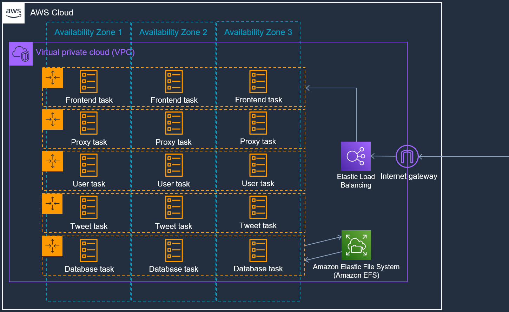
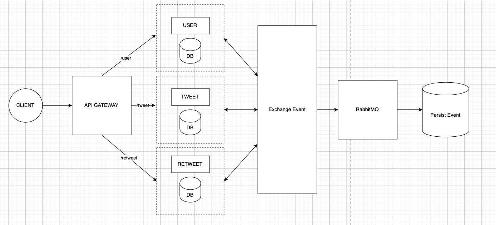

# Tavitter
## About
Tavitter is a microservice based twitter-like application. 
It is composed of 6 AWS Fargate services running on an AWS ECS cluster.
The responsibilities of each service can be described as follows

| Service | Description                                                        |
|---------|--------------------------------------------------------------------|
| db      | A mongodb database which records the data of tweets and users.     |
| proxy   | A reverse proxy that is powered by Nginx.                          |
| user    | A service that is responsible for user account management.         |
| tweet   | A service that handles tweets from users.                          |
| front   | A service that is responsible for frontend operations and display. |

To better understand the architecture, the following diagram can be observed:


In addition, the backed can be visualized as follows:


As for why there are 2 docker-compose files, one is for local development and the other is for deployment on AWS.
## Running
To run the application on your local machine, one must have docker and docker-compose installed.
If said criteria is met, proceed to run the following command:
```bash
docker-compose up --build
```
## Members
1. Patkamon Awaiwanont 6310546040
2. Sittipat Chandang 6310545418
3. Thanabardi Tashasiraphat 6310546368